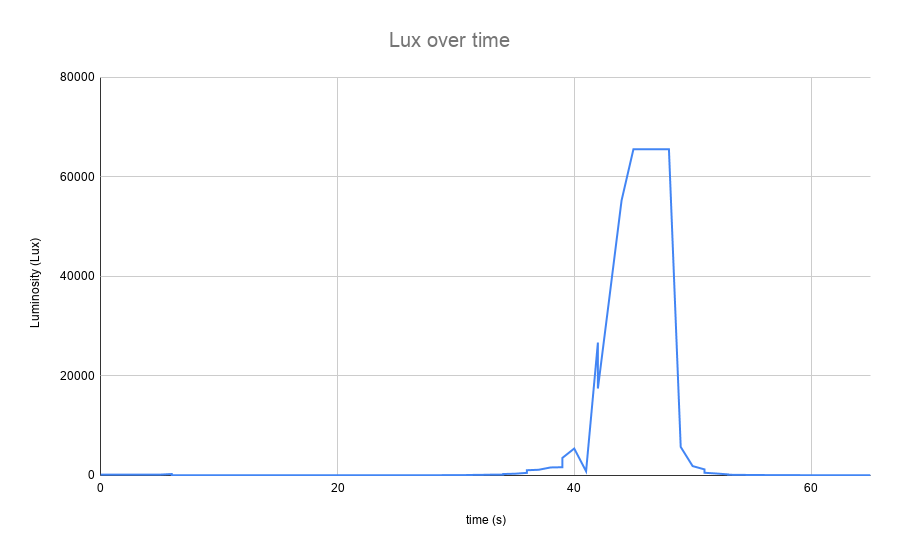
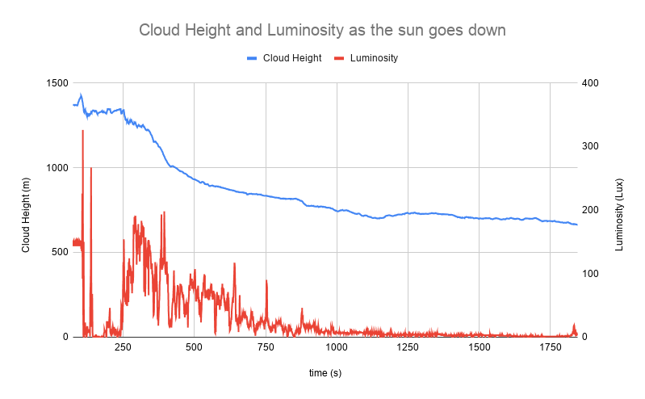
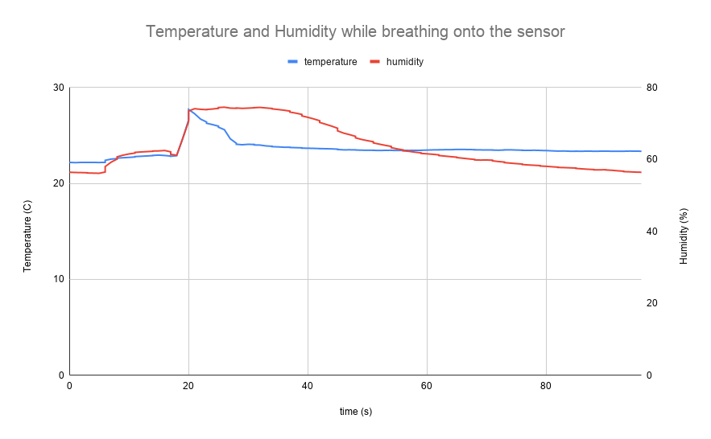

### Simple Weather Station and Light detector 
Simple software which uses various X-chips from [XinaBox](https://www.xinabox.cc) to read in the current temperature, humidity, atmospheric pressure, UV light and visiable light using sensors and display this data on an OLED screen while also saving it to a csv file.  

### Requirements 
 - #### Hardware
   - [CC03](https://www.xinabox.cc/collections/core/products/cc03) microcontroller
   - [OD01](https://www.xinabox.cc/collections/output/products/od01) OLED Display 
   - [IP02](https://www.xinabox.cc/collections/interfaces-1/products/ip01) interface for connecting core to computer
   - [SW01](https://www.xinabox.cc/collections/sensor/products/sw01) X-chip with 3 sensors: temperature, humidity, atmospheric pressure
   - [BR01](https://www.xinabox.cc/collections/bridges/products/br01) bridge to connect X-chips to Raspberry Pi
   - [SL01](https://xinabox.cc/collections/sensors/products/sl01) UV and Visable light detector
   - Raspberry Pi 3B+ 
 - #### libraries 
  - luma.core and luma.oled libraries
  - bme280 python library
  - VEML6075 python library

 When using the Raspberry Pi, the sensors and display are connected using the BR01 Bridge, which can be easily connected to the GPIO pins on the Pi. 
 If you don't want to use the Pi, the CC03 microcontroller can be used instead, which can be connected via USB to your computer using the IPO2. 

We install everything using pip3, since the VEML6075 libraries can only be used with python3.

### Set-Up
 - `sudo apt install python3-dev python3-pip libfreetype6-dev libjpeg-dev build-essential libopenjp2-7 libtiff5 python3-smbus i2c-tools -y`
 - `git clone https://github.com/adafruit/Adafruit_Python_GPIO.git`
 - `sudo pip3 install adafruit-circuitpython-VEML6075`
 - `sudo pip3 install RPi.bme280`
 - `sudo pip3 install luma.core`
 - `sudo -H pip3 install --upgrade luma.oled`
 - In order to use i2c on your Pi you will also need to enable it using `sudo raspi-config`

Dew Point is the highest possible temperature at which water vapor can condense to form dew. For example, if the relative humidity in your room is high, you can observe dew forming on the surface of the window. This happens because the temperature in the vicinity of the window has dropped below the dew point.

Calculating the dew point can be helpful in many areas: 
 - Meteorology
 - Aviation - the dew point temperature is calculated to assess the probability of a carburetor icing, or fog appearing
 - Agriculture - to sustain optimal humidity in a greenhouse and to avoid water condensation on the plants
 - Technology - dew point meters are used in the generation and usage of various technical gases.
 - Medicine - e.g. monitoring of the sterilization process

The python program calculates the dew point from the temperature, humidity and atmospheric pressure using [this](https://en.wikipedia.org/wiki/Dew_point#Calculating_the_dew_point) formula, where the wet bulb temperature is approximated using a formula in [this](https://journals.ametsoc.org/doi/pdf/10.1175/BAMS-D-16-0246.1) scientific journal.

The Cloud base height is distance from see level to the base of a cloud. The cloud base height is calculated using the approximation shown [here](https://en.wikipedia.org/wiki/Cloud_base). This is obviously also useful to know, especially in aviation. 

### Video Demonstration [Here](https://youtu.be/yRiE1-ey24E)

### Graphs of data

